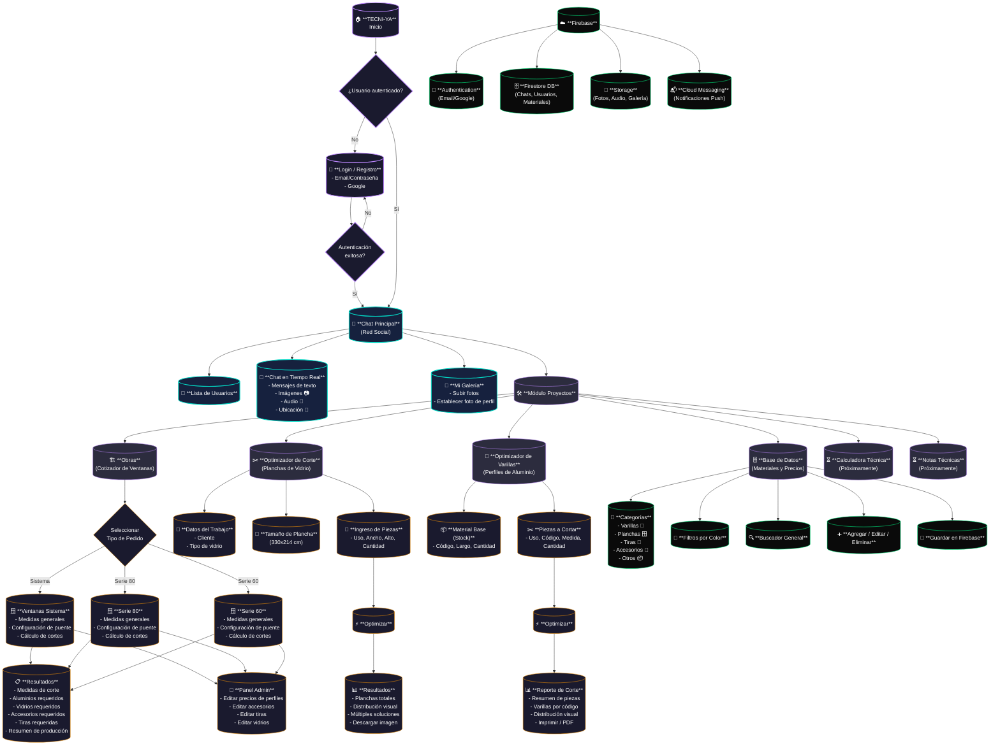

# Diagrama de Flujo - TECNI-YA

---

## 📋 Resumen del Flujo

1. **Inicio → Login**: El usuario se autentica con email/contraseña o Google.
2. **Chat Principal**: Red social con chat en tiempo real, envío de imágenes, audio y ubicación.
3. **Módulo Proyectos**: Panel central con acceso a todas las herramientas técnicas.
4. **Obras (Cotizador)**: Calcula materiales para ventanas (Sistema, Serie 80, Serie 60) con configuración de puente, cortes, aluminios, vidrios, accesorios y tiras requeridas.
5. **Optimizador de Corte**: Optimiza el corte de planchas de vidrio ingresando piezas y obteniendo la mejor distribución.
6. **Optimizador de Varillas**: Optimiza el corte de perfiles de aluminio a partir de stock y piezas requeridas.
7. **Base de Datos**: CRUD completo de materiales (varillas, planchas, tiras, accesorios) con persistencia en Firebase Firestore.
8. **Firebase**: Backend que soporta autenticación, base de datos en tiempo real, almacenamiento de archivos y notificaciones push.
